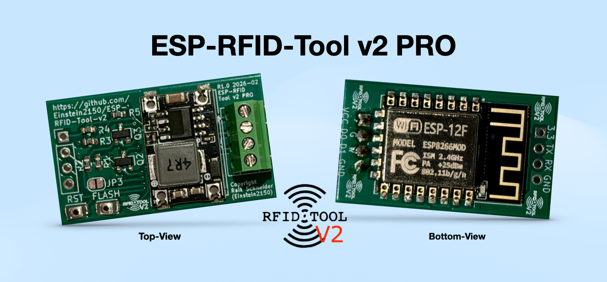
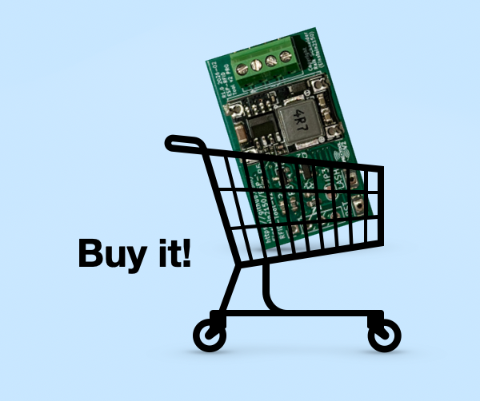
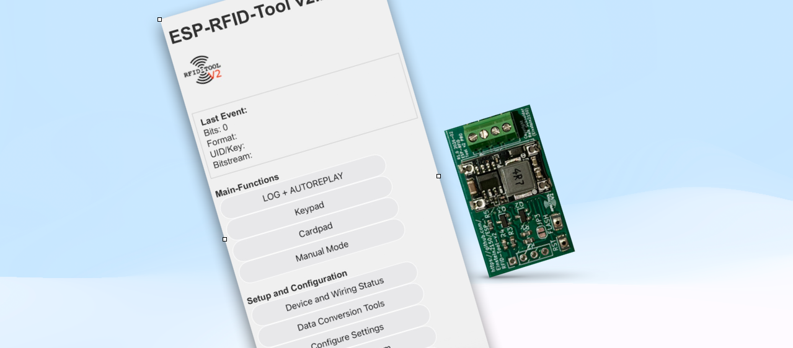
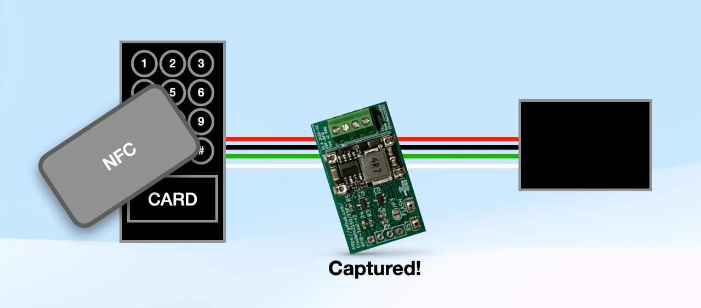
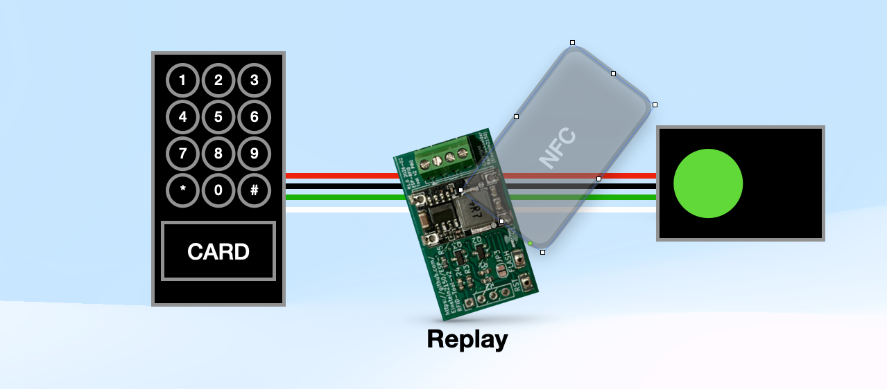
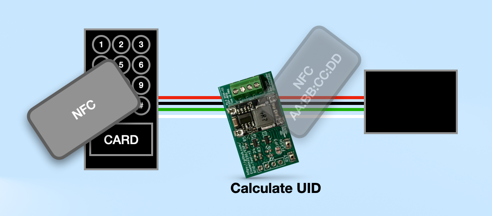
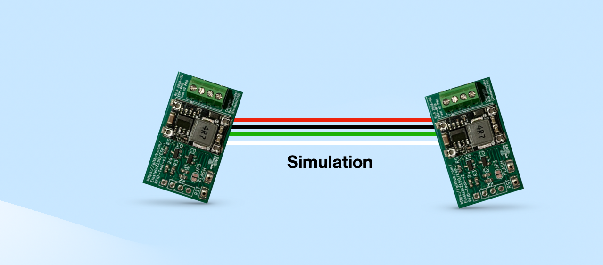
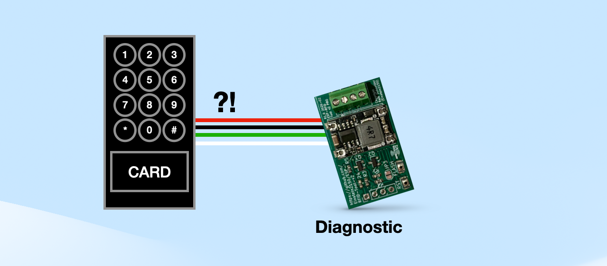
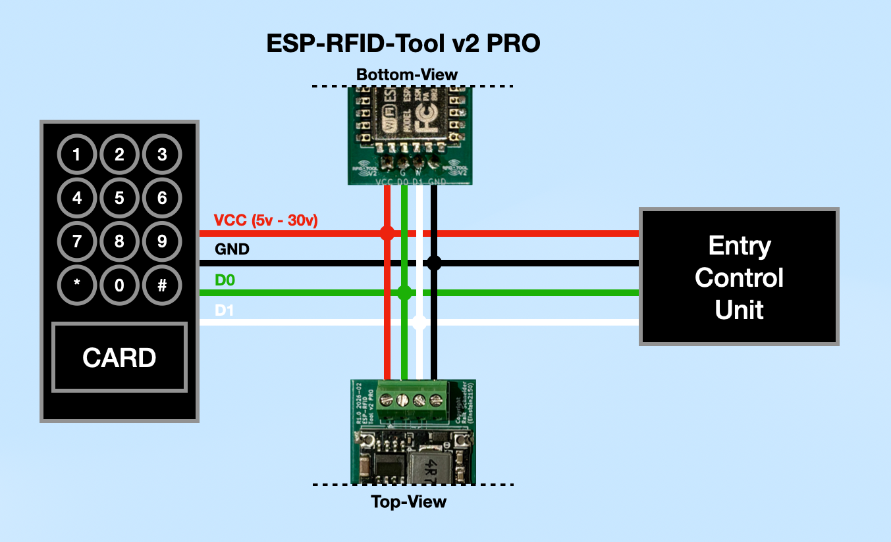
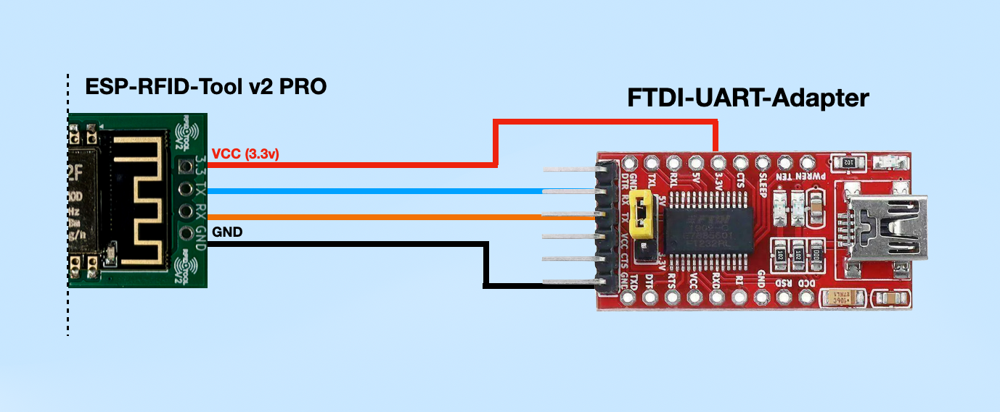

# ESP-RFID-Tool-v2 
by Raik Schneider (Einstein2150)

**ESP-RFID-Tool v2 PRO Board made with ❤️ in Germany - in cooperation with  [multi-circuit-boards.eu]( https://www.multi-circuit-boards.eu)**

  
ESP-RFID-Tool-v2 PRO Firmware: [https://github.com/Einstein2150/ESP-RFID-Tool-v2/releases](https://github.com/Einstein2150/ESP-RFID-Tool-v2/releases)  
## Buy the ESP-RFID-Tool v2 PRO

[Store link](http://RFID-tool.foto-video-it.de)
 
## Features

### UI 2.0
- Modern, redesigned user interface  
- Optimized for mobile devices
- Live Event-Monitor

### Replay 2.0
- Integrated MOSFETs provide significantly more stable data replay compared to the legacy board and protect the hardware from high current  
- New direct replay function in the log. Select a capture and replay it instantly with a single click. Field tested  
- New Keypad Mode  
- New Cardpad Mode  

### Status Page
Status page with useful diagnostic information:

- Wiegand wiring check  
- Device uptime  
- Memory information  
  
### Hex Magic in Captured Data
- The firmware automatically calculates the card UID in 32 bit, 34 bit, and 35 bit modes and displays it in the logfile  
- Significantly simplifies the creation of clone cards

  
## Intended Use Cases

- Security research and red team assessments  

  - Capturing card values for later analysis or reproduction  
  - Replaying raw binary captures  

  - Calculate card UID from data-streams

  - Fuzzing access control systems  
  - Brute forcing PIN codes  
  - Denial of service testing  

- Building a standalone device for capturing credentials or testing badges and card readers without a Wiegand controller  

 
  - Add an external power source and a reader to create a portable unit  
  - Use a bench power supply for hardware testing  

- Troubleshooting installations  

  - Diagnosing card readers  
  - Verifying data lines  
  - Testing for faulty cards  

- Functional testing of access control hardware for merchants or resellers  

- Experimenting with systems that use a Wiegand interface  

- Simulating an access control system using multiple ESP RFID Tool v2 PRO units  

The ESP RFID Tool v2 PRO is not intended for unlawful use.
  
## What Is It

The ESP RFID Tool v2 is a universal data logger designed to capture raw binary data from a standard 5V Wiegand interface.

The device can log credentials from access control systems or virtually any device that utilizes a Wiegand interface, including:

- RFID and NFC readers  
- PIN pads  
- Magnetic stripe systems  
- Barcode readers  
- Certain biometric systems  

The primary target group includes 26 to 37 bit HID cards.

For known card types, both the binary data and the UID are displayed directly in the log. The log provides an instant one click replay function.

For unknown card types, only the raw binary data is stored.
  
## Installation

The device can be integrated directly into an existing system and powered from the existing wiring. Alternatively, it can be used to convert a reader into a standalone portable logging unit by adding an external power source.

Wiring requires four connections:

- Positive  
- Ground  
- D0 Green  
- D1 White  

Operating voltage range: 5V to 30V.

## Accessing Logs

Logs and configuration settings are accessible through a web based interface.

The device features WiFi capability and can:

- Create its own access point  
- Connect to an existing network  

If access to the web interface is lost, bridge the J3 jumper during power up or reset to restore access without deleting log files.
  
## Technical Background

The hardware is based on an ESP12 WiFi chip with an integrated TCP IP stack and microcontroller.

The software is open source and licensed under the MIT License.

### Wiegand Interface Overview

A Wiegand interface uses three wires:

- Ground  
- Data0  
- Data1  

A logical zero is transmitted when Data0 is pulled low briefly.  
A logical one is transmitted when Data1 is pulled low briefly.

Typical timing:

- 40 microseconds low pulse  
- 2 milliseconds between bits  

The device can capture from 1 bit up to 4096 bits. By default, the buffer is limited to 52 bits and can be increased via the settings page in the web interface.

If a 32 bit, 34 bit, or 35 bit sample is captured, the UID is calculated automatically.

  
## TX Mode

In TX Mode, the ESP RFID Tool v2 PRO can transmit Wiegand data with full signal strength. The MOSFETs actively pull the data lines to ground for clean and reliable transmission.

Capabilities:

- Replay any log entry instantly with one click using the LOG plus AUTOREPLAY function  
- Transmit manual keypad data using the Keypad function  
- Transmit manual card data by specifying a UID in the Cardpad function  
- Transmit manual data using the legacy Manual Mode 
  
## Installation Notes

- Ensure that the reader outputs data in Wiegand format  

Connections:

- D0 Green to D0 Green  
- D1 White to D1 White  
- VCC to VCC or Positive  
- GND to GND or Negative  

Additional notes:

- Supports 5V to 30V without significant heat generation  
- Minimum required connections are D0, D1, and GND  
- For standalone operation, VCC must also be connected  
- A steady blue LED indicates successful startup  
- Wiring can be verified on the device status page  

## Flashing Firmware

### Option 1: OTA via Web Interface, Recommended

1. Download the latest version:  
   https://github.com/Einstein2150/ESP-RFID-Tool-v2/releases  
2. Log in to the device admin panel  
3. Perform the firmware upgrade  
 
### Option 2: ESPWebTool with FTDI UART Adapter

1. Download the latest firmware release  
2. Connect the FTDI UART adapter:

   - GND to GND  
   - TX to RX  
   - RX to TX  
   - 3.3V to VCC  

3. Use a web tool such as https://esp.huhn.me/  
4. Flash the binary file    
  
## Software Help

### Accessing the Web Interface

SSID: ESP-RFID-Tool  
URL: http://192.168.1.1  
  
### Default Credentials

Admin Interface:  
- Username: admin  
- Password: rfidtool  

FTP Server:  
- Username: ftp-admin  
- Password: rfidtool  

### WiFi Configuration

Network Type:

- Access Point Mode: Creates a standalone access point without internet connectivity. Close proximity required  
- Join Existing Network: Connects to an existing network. Remote access possible  

Additional settings:

- Hidden SSID option  
- SSID  
- Password  
- Channel  
- IP address  
- Gateway  
- Subnet, typically 255.255.255.0   
  
### Web Interface Administration

- Configure username and password for administration and firmware upgrades  
- FTP server supports Passive Mode only  
- Enable or disable the power LED  
- Customize the log file name for different assessments   
  
### List Exfiltrated Data

Displays all log files containing captured RFID tags.  
  
### Format File System

Erases all contents of the SPIFFS file system, including all RFID log files.

Formatting may take up to 90 seconds.  
All configuration settings are retained unless the device is rebooted during the process.

### Firmware Upgrade

Authenticate using the configured username and password.

After a successful upload, manually reset the device.

### Reset

Ground GPIO 4 or D2 during power up to restore the default configuration without deleting log files.
  
#### Restore Default Settings  
    
* Option 1: Go to settings under web interface and choose restore default configuration.  
* Option 2: Ground GPIO 4 / D2 before booting the device. (Either before powering on or bridge it and reset the device)   
* Option 3: Connect via serial(9600 baud) and send the command "ResetDefaultConfig:" without quotes.  
  
  
## Licensing Information

The legacy version of this software was originally created by Corey Harding:  
https://github.com/rfidtool/ESP-RFID-Tool  

The ESP RFID Tool software is licensed under the MIT License.

### Libraries and Borrowed Code

#### Arduino and ESP8266 Core Libraries
- GNU Lesser General Public License Version 2.1  
- Various authors  

#### ArduinoJson.h
- MIT License  
- Copyright 2014 to 2017 Benoit Blanchon  

#### ESP8266FtpServer.h
- GNU Lesser General Public License Version 2.1  
- Originally by nailbuster, later modified by bbx10 and apullin  

#### WiegandNG.h
- GNU Lesser General Public License Version 2.1  
- JP Liew  

#### Wiegand Preamble Calculator Code
- No license specified  
- Fran Brown, Bishop Fox  

#### strrev.h
- Custom License  
- Copyright 2007 Dmitry Xmelkov  

#### aba-decode.py
- No license specified  
- Andrew MacPherson  

#### hexmagic.h
- Custom License  
- Copyright 2024-2026 Raik Schneider (Einstein2150)  